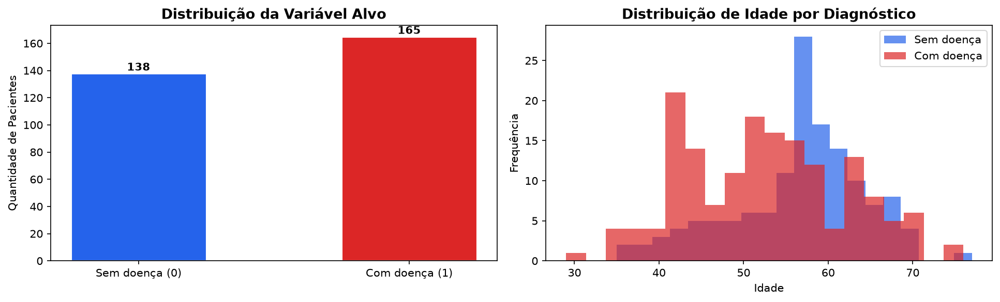
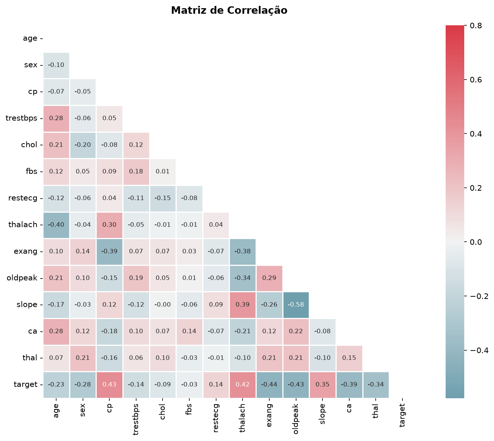
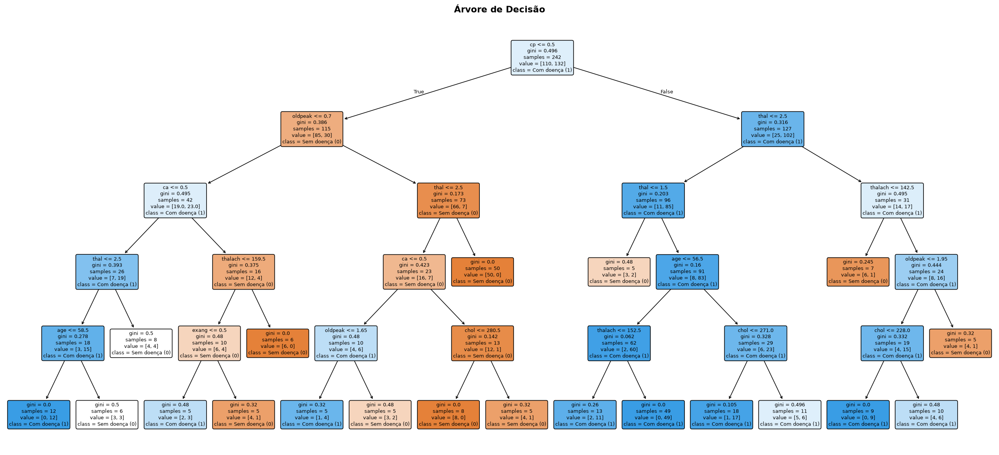
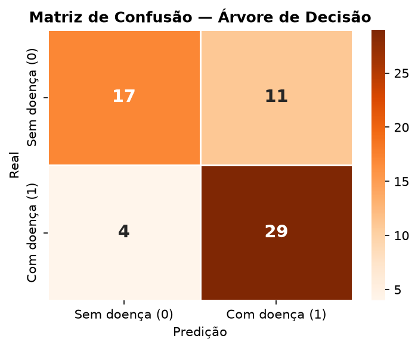
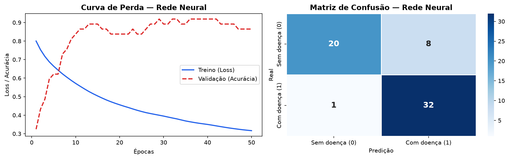
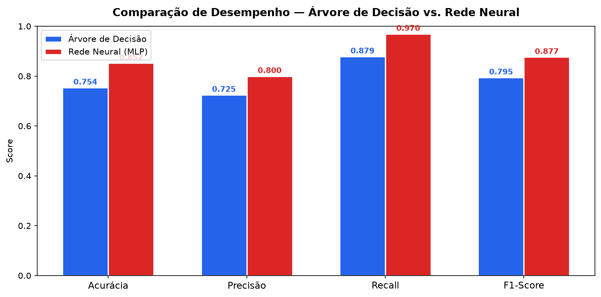

# Disciplina de Inteligência Artificial , Professor Munif , Unicesumar 2026

Este repositório contém o trabalho referente ao 2° bimestre da disciplina de Inteligência Artificial. O projeto treina e compara dois modelos de IA, sendo eles: **Árvore de Decisão** e **Rede Neural MLP**. Os modelos foram treinados para prever se um paciente possui doença cardíaca a partir de seus dados clínicos a partir do **dataset** [Heart Disease](https://archive.ics.uci.edu/dataset/45/heart+disease).

## Integrantes

- Gabriel Rodrigues - RA: 23038182-2
- Henrique Pacheco  - RA: 23293915-2
- Hugo Zuin         - RA: 23000248-2

---

## Estrutura do projeto

```bash
cardioML/
├── data/
│   └── dataset.csv                # Dataset (baixado automaticamente)
├── src/
│   ├── config.py                  # Caminhos e constantes centralizadas
│   ├── dataset.py                 # Carga e preparação dos dados 
│   ├── train.py                   # Treinamento dos modelos 
│   ├── metrics.py                 # Cálculo das métricas 
│   ├── plots.py                   # Geração dos gráficos
│   └── pipeline.py                # Orquestração das etapas
├── models/
│   ├── decision_tree.pkl          # Árvore de Decisão treinada
│   ├── mlp_classifier.pkl         # Rede Neural treinada
│   └── scaler.pkl                 # Normalizador
├── figures/                        
│   ├── comparacao.png             # Caminhos e constantes centralizadas
│   ├── grafico_arvore.png         # Carga e preparação dos dados 
│   ├── grafico_correlacao.png     # Treinamento dos modelos 
│   ├── grafico_distribuicao.png   # Cálculo das métricas
│   ├── grafico_redeNeural.png     # Caminhos e constantes centralizadas
│   └── matriz_arvore.png          # Gráficos gerados
├── main.py                        # Ponto de entrada
├── pyproject.toml
├── uv.lock
├── README.md
└── README.pdf
```

## Como Executar

### Usando uv

```bash
uv run python main.py
```

O script executa todo o fluxo automaticamente: prepara os dados, treina os modelos, gera os gráficos e exibe a comparação.

> **Observação:** o dataset é baixado automaticamente na primeira execução e salvo em `data/dataset.csv`. Nas execuções seguintes, a cópia local é reutilizada (não é necessário internet novamente).

---

## Projeto

### Contextualização

Doenças cardiovasculares são a principal causa de morte no mundo, responsáveis por cerca de 17,9 milhões de óbitos anuais segundo a Organização Mundial da Saúde. O diagnóstico precoce é fundamental para aumentar as chances de tratamento, porém exames clínicos completos são custosos e nem sempre acessíveis.

### Problema

Dado um conjunto de atributos clínicos de um paciente (idade, pressão arterial, colesterol, frequência cardíaca, entre outros), é possível prever se esse paciente possui doença cardíaca?

### Hipótese

Modelos de Inteligência Artificial treinados sobre dados clínicos conseguem classificar com boa acurácia pacientes com e sem doença cardíaca, podendo servir como ferramenta de apoio à triagem médica.

### Métodos de IA Utilizados

- **Árvore de Decisão:** modelo supervisionado e interpretável, baseado em regras de decisão.
- **Rede Neural MLP (Perceptron Multicamadas):** rede neural com camadas totalmente conectadas e maior capacidade de generalização.

---

## Dataset

| Atributo | Descrição |
|---|---|
| `age` | Idade do paciente (anos) |
| `sex` | Sexo (1 = masculino, 0 = feminino) |
| `cp` | Tipo de dor no peito (0–3) |
| `trestbps` | Pressão arterial em repouso (mmHg) |
| `chol` | Colesterol sérico (mg/dl) |
| `fbs` | Glicemia em jejum > 120 mg/dl |
| `restecg` | Resultado do ECG em repouso (0–2) |
| `thalach` | Frequência cardíaca máxima atingida |
| `exang` | Angina induzida por exercício |
| `oldpeak` | Depressão ST induzida por exercício |
| `slope` | Inclinação do segmento ST (0–2) |
| `ca` | Número de vasos coloridos por fluoroscopia (0–3) |
| `thal` | Tipo de talassemia (1–3) |
| `target` | **Variável alvo** (1 = possui doença, 0 = sem doença) |

- **Origem:** Cleveland Heart Disease Dataset, do repositório UCI Machine Learning. O dataset é baixado automaticamente via URL pública. Fonte original: https://archive.ics.uci.edu/dataset/45/heart+disease
- **Quantidade de registros:** 303 amostras
- **Atributos:** 13 features + 1 variável alvo
- **Variável alvo:** `target` (1 = possui doença, 0 = não possui) — 165 pacientes com doença e 138 sem doença
- **Tratamento dos dados:** o dataset não possui valores nulos. As features foram normalizadas com `StandardScaler`, ajustado apenas no conjunto de treino para evitar vazamento de dados.
- **Divisão treino/teste:** 80% para treino (242 amostras) e 20% para teste (61 amostras), de forma estratificada para manter a proporção das classes.

---

### Distribuição da variável Alvo



### Matriz de Correlação



## Treinamento dos Modelos

### Árvore de Decisão

Algoritmo que divide os dados em regiões com base em regras sobre os atributos. É fácil de interpretar, pois cada caminho da raiz até uma folha representa uma sequência de decisões.

**Parâmetros:** `max_depth=5`, `min_samples_split=10`, `min_samples_leaf=5`.



**Matriz de confusão:**



### Rede Neural MLP

Rede neural com três camadas ocultas (64, 32 e 16 neurônios), função de ativação ReLU e otimizador Adam. As features são normalizadas antes do treinamento.

**Parâmetros:** `hidden_layer_sizes=(64, 32, 16)`, `activation=relu`, `solver=adam`, `early_stopping=True`.

**Curva de perda e matriz de confusão:**
 


---

## Modelos Treinados

Após a execução são gerados:

- models/decision_tree.pkl
- models/mlp_classifier.pkl
- models/scaler.pkl

Esses arquivos podem ser reutilizados sem necessidade de novo treinamento.

## Avaliação e Comparação dos Modelos

As métricas utilizadas foram acurácia, precisão, revocação (recall) e F1-score, calculadas sobre o conjunto de teste.

| Métrica | Árvore de Decisão | Rede Neural (MLP) | Melhor |
|---|---|---|---|
| Acurácia | 0.7541 | **0.8525** | Rede Neural |
| Precisão | 0.7250 | **0.8000** | Rede Neural |
| Recall | 0.8788 | **0.9697** | Rede Neural |
| F1-Score | 0.7945 | **0.8767** | Rede Neural |

### Comparação Gráfica



---

## Conclusão

A **Rede Neural MLP** apresentou o melhor desempenho em todas as métricas avaliadas: acurácia de 85,25%, precisão de 80,00%, recall de 96,97% e F1-score de 87,67%. O recall elevado é especialmente relevante na área médica, pois significa que o modelo identificou quase todos os pacientes que realmente possuíam a doença, deixando pouquíssimos casos sem detecção (falsos negativos).

A **Árvore de Decisão**, embora tenha tido desempenho inferior nas métricas, oferece a vantagem de ser facilmente interpretável: é possível visualizar exatamente quais regras o modelo utiliza para classificar um paciente, o que pode ser útil para explicar as decisões a profissionais de saúde.

A hipótese foi confirmada: ambos os modelos conseguiram classificar pacientes com doença cardíaca a partir de dados clínicos, e a Rede Neural alcançou acurácia superior a 85%. Para esse problema, a Rede Neural se mostrou a melhor escolha, equilibrando alta capacidade de detecção (recall) com bom desempenho geral. A Árvore de Decisão permanece como uma alternativa válida quando a prioridade é a interpretabilidade do modelo.
